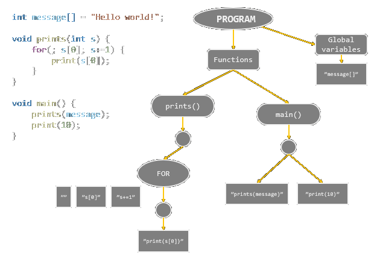

# {{ page.title }}

## [{{ page.puzzle }}](https://adventofcode.com/2021/day/{{ page.day }})

Everything has been thrown into disarray by the collision. There is a dent where the whale hit.

"Divert all power from life support to the deflector shields!"

*We don't have deflector shields*

"Do evasive maneuvers! 50 degrees port, 30 degrees down, 120 degrees starboard, and roll 540 degrees clockwise!"

*Is that wise?*

"Do it!"

The submarine twists an turns as `I2C2` executes your instructions. Everything is now in more disarray, and up-side down. Silence.

"Did we shake off the whale?", you ask optimistically.

*I tried to tell -* `I2C2` begins, but is interrupted by a second hit. Water sprays from a bolt. *- you that there is no chance we can outrun the whale. Evasive maneuvers or not.*

"Do... Do we have any weapons?"

*Negative. We have Christmas light decorating the hull.*

"Divert all power from life support to the Christmas lights!"

*That's not necessary. They don't consume that much power...*

"Do it!"


## Solution

Nothing clever. Just loop through every target position and crab in both parts.

**IntCode:** [{{ page.this }}.txt](2021/{{ page.this }}.txt) &#124; **C lite:** [{{ page.this }}.c](2021/{{ page.this }}.c)


```
{{RAW_INTCODE}}
```

&nbsp;

# Decorating your Syntax tree

The IntC-language we specified yesterday is suitable when writing source code, but for further processing we want to transform the code into a *Syntax tree*. The leaves of this syntax tree will be statements and expressions, and the parent nodes are `if`- statements, `for`-statements, functions, and more.

Here is an illustration of how source code is mapped to a Syntax tree:



(Rough diagram. Many details skimmed over.)

A *good* compiler typically does a series of pre-processing steps, tokenization, and other clever manipulations before generating the syntax tree (unlike my mess of an IntCode-compiler ...).