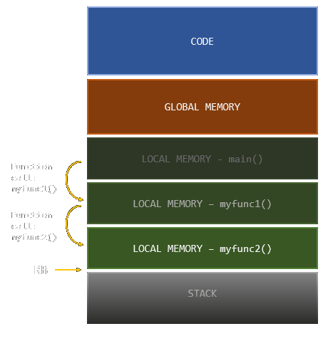

# {{ page.title }}

## [{{ page.puzzle }}](https://adventofcode.com/2021/day/{{ page.day }})

*Syntax error. Syntax error. Syntax error...*

`I2C2` has been repeating the same two words over and over for an hour now. You think he might suffer from a syntax error.


## Solution

One of these problem where there is a really elegant and consise solution if you know the right data structure. Today that structure was a Stack.

**IntCode:** [{{ page.this }}.txt](2021/{{ page.this }}.txt) &#124; **C lite:** [{{ page.this }}.c](2021/{{ page.this }}.c)


```
{{RAW_INTCODE}}
```

&nbsp;

# Memory layout

I have touched upon the the memory layout of the IntCode-programs I build before. There is the code, global memory and local memory. Beyond that is what I call the stack memory. I don't know if it is the appropriate term, but anyway: it holds temporary calculations during expression evaluation.



During the compilation process the *local variables* of a function are assigned a position relative the memory frame of a function call. During execution a memory frame is allocated every time a function-call is made by incrementing the `RB`-register a certain amount.

Each memory frame contains:
- The parameters with which the function was called.
- Local variables.
- The address at which the function was invoked, so that execution can return once the function finishes.