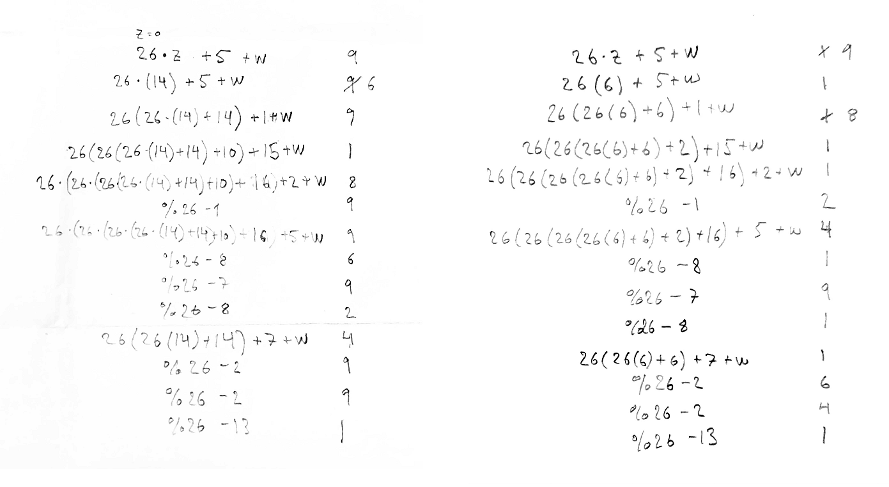

# {{ page.title }}

## [{{ page.puzzle }}](https://adventofcode.com/2021/day/{{ page.day }})

## Solution

Pen and paper - No IntCode. Very fun puzzle (but sad to break my IntCode-streak).

The key was to see that there were two patterns in your instruction sequence (the puzzle input). Following each `inp w` instruction the next sequence of instructions would either do:

- `z = 26*z + <some number> + w`, or
- `z/26` (integer division), under the condition: `z%26 - <some number> == w`

The trick was making sure that the condition was fulfilled for all patterns of the second group. This *also* imposed constraints on patterns in the first group.

**Part 1:** Choose highest allowed value for `w` in every step (had to backtrack a few times).

**Part 2:** Same but now choose the lowest.

&nbsp;

# TBD